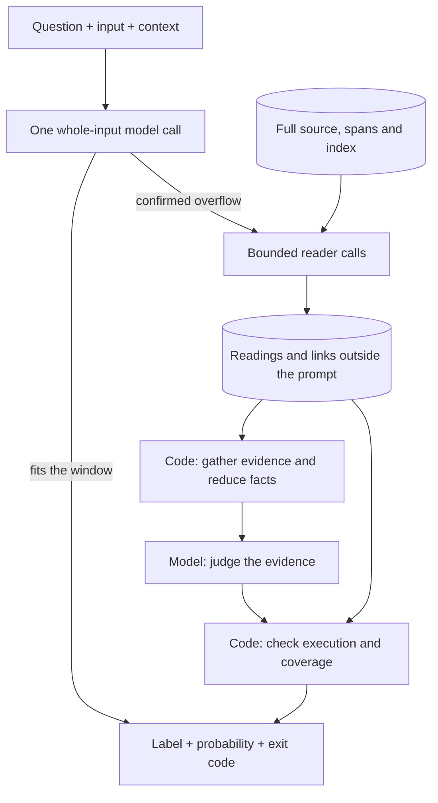

# classif

Semantic decisions for programs.

`classif` sends a question and input to a local open-weight model and returns a label, probability and exit code. Code can branch on meaning: whether a passage answers a question, a change affects access, or a discussion contains a report that needs review.

The model judges meaning. Code supplies input, defines allowed answers and acts on the result. The interface grew from a shell helper into a reusable operation for deterministic programs.

```sh
# Keep a staged diff when its meaning calls for a security review.
git diff --staged |
  ./classif -p "Does this change handle secrets, credentials or who may access what?" > security-review.patch

# Choose a category a script can route.
printf '%s\n' 'Fix a startup crash.' |
  ./classif "What kind of change is this?" -e "bug,feature,chore"
```

`token` can mean a credential, a model's context budget or a parser token. The question distinguishes them. `-p` passes input unchanged when the first label wins, allowing code to send it to a reviewer or queue. Code owns exact rules, computation and actions.

## Quick start

Requirements: Python 3.12 and [Ollama](https://ollama.com/) with log-probability support. Tested with Ollama 0.34.3. For this quick start, the Ollama server must be running at `localhost:11434`. The Python command has no third-party dependencies.

```sh
git clone https://github.com/Piotr1215/classif.git
cd classif
```

The default model, `winnow:12b-q4_K_M`, is a [Winnow-12B](https://huggingface.co/EldanRing/Winnow-12B) typed-decision fine-tune quantized in [Piotr1215/Winnow-12B-GGUF](https://huggingface.co/Piotr1215/Winnow-12B-GGUF). The tested Ollama setup loads it in about 8 GB on a 12 GB GPU. Create it with Ollama's Gemma 4 renderer:

```sh
cat > Modelfile <<'MODEL'
FROM hf.co/Piotr1215/Winnow-12B-GGUF:Q4_K_M
TEMPLATE {{ .Prompt }}
RENDERER gemma4
PARSER gemma4
PARAMETER temperature 1
PARAMETER top_k 64
PARAMETER top_p 0.95
MODEL
ollama create winnow:12b-q4_K_M -f Modelfile

./classif "Is this about Kubernetes?" "The pod keeps crashlooping."
```

One local run returned `yes 0.95`, exit 0. Scores are calibrated for this model and vary with input and model. Run `./classif` from the checkout or add it to `PATH`.

To use an Ollama library model for one invocation:

```sh
ollama pull gemma4:12b
CLASSIF_HOSTS=localhost:11434=gemma4:12b \
  ./classif "Is this about Kubernetes?" "The pod keeps crashlooping."
```

A question about a long input that one scene or one state settles first reads the passages closest to it, ranked by a small embedding model; a claim about every line still reads in full. Pull the model once, or the search ranks by words alone and trusts no exists answer of no:

```sh
ollama pull embeddinggemma
```

Save a default as a `host:port[=model]` entry in `~/.config/classif/hosts`. `llama3.2:3b` uses less memory and answers short decisions faster but scored worse on the project's open-question sets. Smaller readers dismissed decisive passages in long-input experiments. See [model comparisons and calibration](docs/reference.md#eval-record) when choosing a model or threshold.

## Decision inputs

| Part | What it does | Interface |
| --- | --- | --- |
| Question | States what to decide | First argument |
| Input | Supplies the material to judge | Second argument, stdin or `-i FILE` |
| Output shape | Names the answers your code accepts | `yes`, `no`, `unknown`; or `-e` options |
| Context | Supplies rules or references for the decision | `-c FILE` |

Supply a policy and the discussion it governs:

```sh
./classif -j -c feedback-policy.txt -i discussion.txt \
  "Does this discussion contain an ongoing privacy exposure report?"
```

The policy can distinguish a report from a complaint, hypothetical risk or resolved incident. Changing the policy changes the decision while preserving the output shape.

Option descriptions guide the decision; the command prints only option names:

```sh
printf '%s\n' 'Fix a startup crash.' |
  ./classif "What kind of change is this?" \
    -e "bug=repairs broken behavior" \
    -e "feature=adds a capability" \
    -e "chore=maintenance with no behavior change"
```

`-e` accepts one to nine options and adds `none` when no option fits. Quote descriptions in scripts. Repeated `-i` files, or `-i a,b`, join several sources as one input. A positional input is literal text even when it looks like a filename.

`-c` supplies the rule to every reader and judge call. A rule embedded in a large input may be absent from later passages. Context must fit the model window alongside the input or one passage. Put large sources in `-i`. Reference-link calls are independent of the policy.

## Results and exit codes

Plain output is `LABEL P`. `-j` returns JSON with scores, model and execution metadata. `unknown` means the input does not settle the question; `no` answers it negatively.

| Exit | Meaning |
| --- | --- |
| `0` | First label or option won: `yes` by default |
| `1` | Another label or option won, including `unknown` or `none` |
| `2` | Unscored: for example, a connection failure or inadequate label mass |
| `3` | Insufficient evidence or coverage, a deadline cut, or a score below `-t` |

`-t P` sets a probability floor. `-d SECONDS` bounds the work. `-p` emits input only when the first label wins and meets any supplied threshold. Failed or incomplete decisions, and decisions below a supplied `-t` floor, emit nothing. A low score alone does not block input. Inspect the exit status to route results separately; the last command's status in a pipe does not preserve classif's status.

`-w`, or `--why`, prints the lines the answer rests on: the lines that fit or break a claim, or with `-e` a run of each voting passage that gives the chosen option alone. It is slower and can differ from a single whole-input decision. Memory-mode JSON includes evidence, source offsets and the answer's basis for applications to show before acting.

`classif tag` asks several questions about one text and reads the text once, printing one `NAME ANSWER P` line per question; see [several questions, one text](docs/reference.md#several-questions-one-text).

```sh
notmuch show --format=raw id:x |
  ./classif tag 'urgency=today,this week,no deadline' 'kind=asks me,fyi,newsletter'
```

See [shell use cases](docs/use-cases.md) for routing, filters, game-loop actions, feedback policies and named decision specs. [The reference](docs/reference.md) covers the full CLI, host configuration, scores and calibration. [Claude Code integration](docs/claude-code.md) shows a coding agent asking classif about text too large for its context.

## Architecture

A question's decision call predicts one token; classif reads label scores from its log probabilities. `classif tag` instead generates a short JSON object, one key and one digit per question, and reads each digit's log probabilities. The only other model call is the embedding model behind the search index, which predicts nothing. Code groups token variants, applies any fitted calibration and formats the result. The answer is bounded, but the model must still evaluate the input prompt.

Short inputs use one whole-input call. `truncate: false` makes the server reject overflow. Only confirmed overflow starts the external-memory executor.



For long input, code stores the source and intermediate work outside the prompt. A root model call selects a predefined reading kind. Code searches and orders spans, stores judgments, counts identifiers, compares dates and gathers evidence for a final call.

A question one scene or one state settles goes to the search: the text is cut into passages of about 1,200 characters, each embedded once by `embeddinggemma`, kept beside the readings under `--cache`, and one judge call reads the passages closest to the question by words and by meaning, about 30,000 characters. A yes is a witness among them; a no means the text's closest passages do not show it. Anything the search does not settle, and every claim about every case, goes to the executor, which can seek a witness or counterexample, read every line, or use counted facts and an even sample for whole-text questions. Graph links can scope a question to related lines. Reports distinguish `search`, `sample`, `component` and complete-read answers; only a complete read establishes full-source coverage.

Code checks incomplete reads, conflicting latest facts, evidence budgets and deadlines. Confidence cannot complete an unfinished read. Coverage records processed spans, not the correctness of their labels; a reader can dismiss decisive evidence and produce a wrong answer.

### Reusable links and readings

A reference such as "the retest now requires signing in" can point back to a report about private material. Code links shared names or identifiers; bounded model calls resolve backward references. These edges can serve different questions about the source.

With `--cache`, repeated claims reuse readings of unchanged text; without it nothing is written to disk. Changed lines or policies require fresh work. Links are independent of policy. The final verdict is not cached, and new questions generally need new claim-specific readings.

Graph reference windows and traversal are bounded. The executor skips linking when its estimated calls exceed a full passage read, as can happen with common names. Exceptions outside a component can change the answer. [Architecture details](docs/architecture.md) cover these limits and the cache contract.

## Recorded costs

Recorded runs on 2 October 2026 used `gemma4:12b` on one 12 GB GPU:

| Work | Time |
| --- | ---: |
| Short text, direct decision | 0.3 s |
| 153k characters, first whole-input question | 22 s |
| Same text, another question with a warm prompt cache | 0.9 s |
| 306k characters, first piecewise claim | 91 s |
| Same text and claim again, `--cache` | 0.8 s |

Recorded on 3 October 2026 with `winnow:12b-q4_K_M` and `embeddinggemma`, through the search:

| Work | Time |
| --- | ---: |
| 772 KB novel piped from `curl`, first question (index built) | 17 s |
| Same novel, another question, `--cache` (index saved) | 4 s |
| 367 KB man page, a claim one line settles | 9 s |
| Same man page, a claim about every line, read in full | 2 to 4 min |

Warm prompts, readings saved under `--cache` and small linked components save different kinds of work. New text still requires prompt evaluation. See [recorded costs and limits](docs/architecture.md#cost) for tested conditions.

## Inspiration

[Jev](https://docs.typesafe.ai/introduction) inspired the idea of semantic decisions as operations inside software. [SemIf-OpenJev](https://github.com/TheoLeeCJ/SemIf-OpenJev) informs the one-token scoring approach; its public authored decision cases are included under [their terms](evals/cases/THIRD_PARTY.md).

[Recursive Language Models](https://arxiv.org/abs/2512.24601), by Zhang, Kraska and Khattab, inspired the long-input architecture: external source data, smaller reads and intermediate values outside the model context. classif uses a fixed executor and predefined model steps. It has no benchmark against a live Jev endpoint, and the RLM paper's results do not establish classif's performance.

classif began as a shell helper. The goal is a foundation other tools can build on: code defines the workflow, and a bounded model judgment supplies the semantic branch.

## Tests

```sh
python3 -m unittest discover -s tests
```

Tests use fake Ollama servers and injected readers; they need no model. Separate real-model evaluations measure decision quality. [The reference](docs/reference.md#tests-and-evals) describes the evals and datasets.
