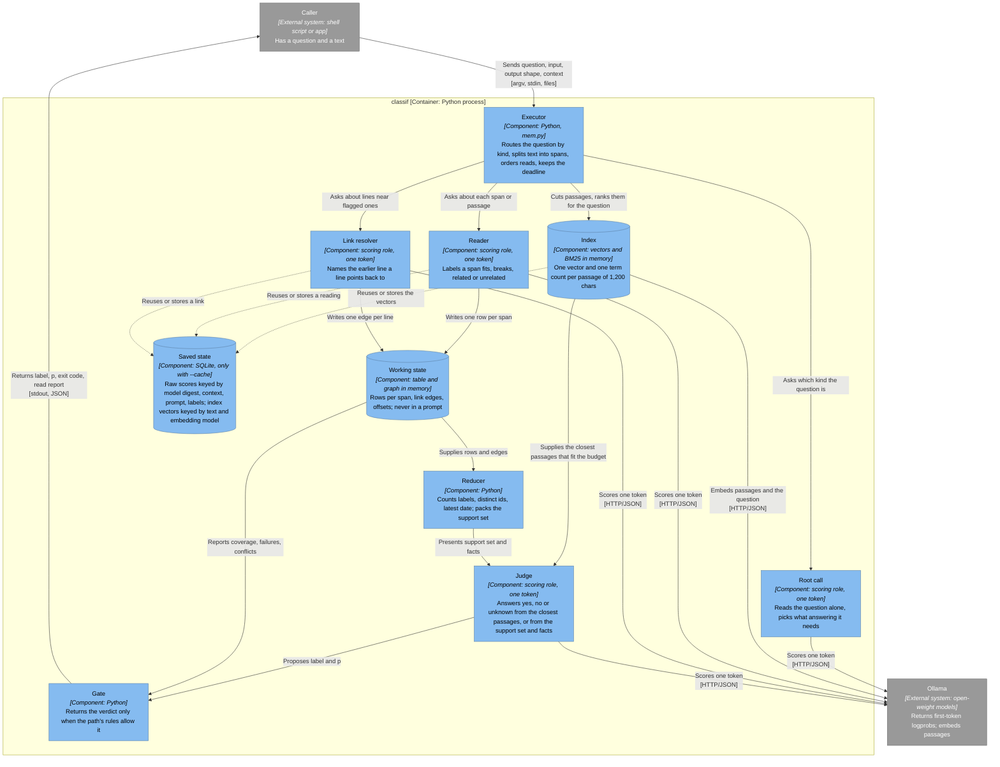
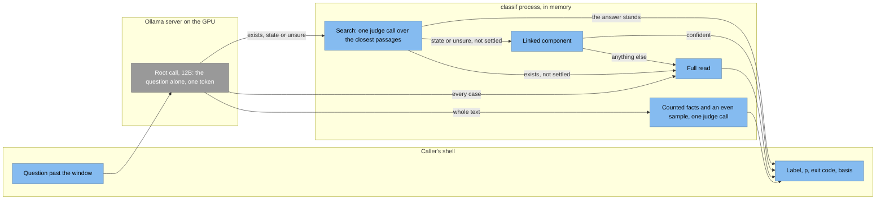
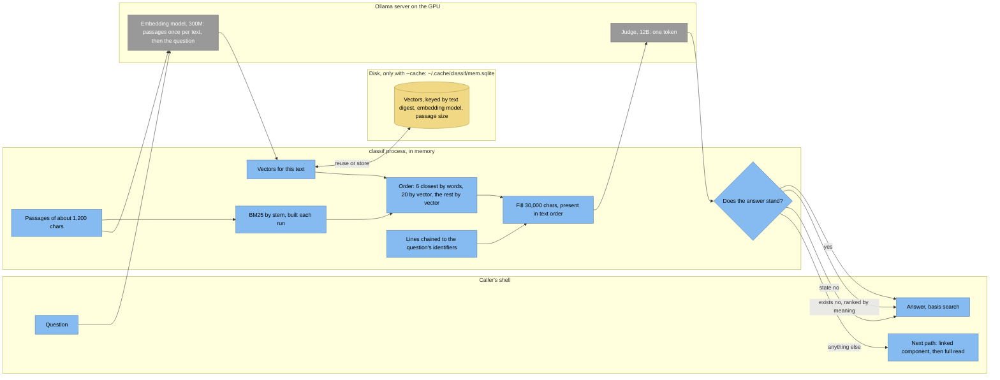
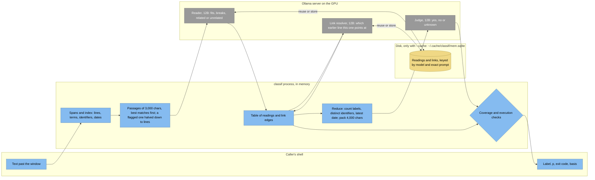

# Architecture

How `classif` answers one question about one text. The [README](../README.md) gives the short form and the quick start; [use cases](use-cases.md) show shell patterns; the [reference](reference.md) lists flags, scores and exit codes.

## Overview

A semantic decision is one model call that predicts one token. The label probabilities come from that token's logprobs, nothing is generated or parsed, and the result is a label, a probability and an exit code.

A text that fits the model window is read whole in that one call. A text past the window is read by a fixed program. One root call reads the question alone and picks what answering it needs. A claim one line settles, or one about a state, goes to the search: code cuts the text into passages, an embedding model indexes them once, and one judge call reads the passages closest to the question. A question about the text as a whole gets one call over facts code counts and a sample. What the search does not settle, and every claim about every case, goes to the full read: code splits the text into spans, orders them, asks the model one-token questions about passages and lines, keeps every answer in a table outside any prompt, reduces the table in code, asks one final one-token question over the evidence, and lets code decide whether that answer may be returned. The model never sees the whole text, and its confidence never stands in for coverage: early versions judged chosen excerpts and answered confidently while a later line reversed the answer, and no threshold recovers a line that was never read.

This is the [Recursive Language Models](https://arxiv.org/abs/2512.24601) pattern with the generated program replaced by a fixed one. Alex L. Zhang, Tim Kraska and Omar Khattab (arXiv:2512.24601, 2025; [v3, 11 May 2026](https://arxiv.org/pdf/2512.24601v3)) "treats the user prompt as part of the environment": the root model examines slices, launches sub-calls and keeps intermediate values in a persistent environment outside its own context. `classif` keeps the environment and the sub-calls and removes the root model's freedom to write code, so every model step stays one token and every coverage claim is made by code. [SemIf](https://github.com/TheoLeeCJ/SemIf-OpenJev), which reads option scores from a local model's first token, informs the scoring side.

The root call and the paths after it are conditional computation in the sense of the sparsely gated mixture of experts (Noam Shazeer, Azalia Mirhoseini, Krzysztof Maziarz, Andy Davis, Quoc Le, Geoffrey Hinton and Jeff Dean, [arXiv:1701.06538](https://arxiv.org/abs/1701.06538), 2017): a gate reads each input and runs only the experts it picks, so the cost of an example is the cost of its path. Here the gate is one token over four kinds, the experts are fixed programs over the same model rather than sub-networks trained with the gate, and nothing balances load across them. The order after the gate, the search before the linked component before the full read with code deciding whether an answer stands, is the LLM cascade of FrugalGPT (Lingjiao Chen, Matei Zaharia and James Zou, [arXiv:2305.05176](https://arxiv.org/abs/2305.05176), 2023): the cheap path answers first and the costly one runs only when a scorer rejects that answer. Whether the served model is itself a mixture of experts is a property of the model, not of `classif`.

## Component diagram

Component diagram for the `classif` process past the window. Scoring roles are the same Ollama model asked different one-token questions, not different models; `mem.py -r` can give the reader role a separate model. The embedding model is a second, smaller model on the same server.

Legend: light blue boxes are components of the `classif` process, cylinders are the stores among them, grey boxes are external systems (the caller and the model server). Solid arrows are the main flow; dotted arrows are the cache. Which components run depends on the path (see [Reading paths](#reading-paths)): a question the search settles touches the root call, the index, the judge and the gate and never reaches the reader; no link calls are made when no read line points back; no judge call when no passage answers an enum question. Each label names the intent; brackets name the channel or protocol.

| Element | Type | Technology | Responsibility |
| --- | --- | --- | --- |
| Caller | External system | Shell script or application | Supplies a question, an input, an output shape and an optional context; acts on the label and exit code |
| Executor | Component | Python, `mem.py` `answer`, `run` and `run_enum` | Picks the path from the root call's kind; cuts and indexes passages for the search; splits the text into spans, orders likely evidence first, schedules passage and line reads, stops at the deadline |
| Root call | Component | Scoring role, one token per call | Reads the question alone and picks one of four kinds: exists, state, every case, whole text |
| Index | Component, store | Python, in memory | One unit vector from the embedding model and one stemmed term count per passage; ranks passages for a question by meaning and by BM25 |
| Reader | Component | Scoring role, one token per call | Labels a span or passage fits, breaks, related or unrelated to the claim; for an enum, picks an option or none per passage |
| Link resolver | Component | Scoring role, one token per call | For a line that points back ("that payment", "she"), names which of the eight earlier lines it points at, or none |
| Working state | Component, store | Python table and graph in memory | One row per span with label, p and status; one edge per resolved line; source offsets; never placed in a prompt |
| Reducer | Component | Python | Counts labels, lists distinct identifiers and the latest date among flagged lines, finds same-date conflicts, packs the support set to the judge budget |
| Judge | Component | Scoring role, one token per call | In the search, reads the closest passages and answers yes or no (yes, no or unknown for a state); in the full read, reads the support set and the facts only |
| Gate | Component | Python | Decides whether the judge's label may be returned: in the search, from the kind and how the passages were ranked; in the full read, from coverage, failures and the plan; otherwise insufficient or unscored |
| Saved state | Component, store | SQLite, `~/.cache/classif/mem.sqlite`, only with `--cache` | Raw log masses keyed by model tag and digest, context size, exact prompt and labels, recalibrated at lookup; index vectors keyed by text digest, embedding model and passage size |
| Ollama | External system | Ollama serving an open-weight model with logprobs and an embedding model | Returns the top logprobs of the first generated token; returns one vector per passage |

| From | To | Intent | Protocol |
| --- | --- | --- | --- |
| Caller | Executor | Sends the question, the input, the output shape and the context | argv, stdin, `-i FILE`, `-c FILE` |
| Executor | Root call | Asks which kind the question is | in process |
| Executor | Index | Cuts the text into passages, asks for the ranking | in process |
| Index | Judge | Supplies the closest passages that fit the budget, in text order | in process |
| Executor | Reader | Asks about each passage, then each line of a flagged passage | in process |
| Executor | Link resolver | Asks about lines near flagged ones that point back | in process |
| Reader, Link resolver | Working state | Write rows and edges | in process |
| Working state | Reducer, Gate | Supplies rows, edges, coverage and failures | in process |
| Reducer | Judge | Presents the packed support set and the facts | in process |
| Judge | Gate | Proposes a label and p | in process |
| Gate | Caller | Returns label, p, exit code and the read report | stdout, JSON with `-j` |
| Index | Saved state | Reuse the text's vectors or store them | SQLite |
| Reader, Link resolver | Saved state | Reuse a stored reading or store a new one | SQLite |
| Root call, Reader, Link resolver, Judge | Ollama | Score one token | HTTP/JSON, `/api/chat` |
| Index | Ollama | Embed the passages once, then the question | HTTP/JSON, `/api/embed` |

Assumptions: the direct path (a text that fits the window) uses the judge role alone. Spec commands (`classif classify`, `smoke`) use the direct path with a saved question template.

## The four parts of a decision

The question is what to decide. The input is the material it is decided on, and it is what the executor splits, reads and reports offsets into; `-f a,b` reads several files as one input. The output shape is the permitted answers. The context is what the decision must take into account beyond the model's weights: a policy, rules, a reference, directives on how to judge. On an input that fits the window, context is input: put the file first. On a long input the pieces decide what the model sees, and a rule that sits in one passage is absent from every other. Two things reach every reader and judge call whatever the pieces: the question, which every reader and judge prompt embeds, and `-c FILE`, placed before the input. The flag's benefits over writing the policy into the question are placement, not reach: the claim stays one sentence for the reader to label against and for the lexical ordering to rank by, and the context is a fixed prefix the server caches. Neither reaches a link call or the root call, since which line a line points back to, and which kind a question is, do not depend on the policy. Saved readings are keyed by the context text, so a changed policy reads again; saved links are not. The context must fit the window beside the input or beside one passage; a larger reference is input, given with `-f`, and the question is asked of it.

## The direct read

One `/api/chat` request with `num_predict: 1`, `temperature: 0`, `think: false`, `top_logprobs: 20` and `truncate: false`. The text goes first and the question last, so the server's prompt cache serves a second question on the same text. Each label's family (case and leading-space variants, or the first piece of a multi-token label) is summed over the top logprobs and normalised. Under half the probability on the labels is unscored. A fitted temperature per model tempers p without changing the winner.

`truncate: false` turns an oversized input into a server error instead of a silent cut. That error, and only that error, routes the question to the paths below. No token count is estimated.

## Reading paths

How to read is the machine's choice, never a flag. Flags say what the caller wants (labels, options, a context, a deadline); how a long text is read is code that runs the same for every claim. Plans were once pinned with `-P` and the linked component with `-g`, which left the caller to know when an early stop or a component answer was safe. Neither is chosen by the model either: a confident wrong choice would bring the confident wrong yes back. The developer executor `mem.py` keeps `-P` and `-g` for evals.

### The root call

Past the window the first call is the root call, as in RLM, where the root model reads the question and picks its program. It reads the question alone, without the text or `-c`, and picks one of four kinds with a probability. A pick at 0.8 or above is trusted; below that it is unsure, and only the kind on top is used, for the search alone.

| Kind | The question | First path | When that does not settle it |
| --- | --- | --- | --- |
| exists | one line that shows it is enough: something is mentioned, described or happened at least once | search, as exists | full read, stopping at a witness |
| state | a current, latest or final state, a value now, an order, a total or a count | search, as state | linked component, then full read, stopping at the line that decides the state |
| every case | it holds only if every case holds, so one line against it settles it | full read, stopping at a counterexample | |
| whole text | its topic, kind, genre, tone, language or quality, or what most of it is | one call over counted facts and a sample | nothing: its answer is final, insufficient included |
| unsure, exists or state on top | | search, as that kind, no included | linked component, then full read of every line |
| unsure, every case or whole text on top | | search, as exists, only a yes trusted | linked component, then full read of every line |

A witness settles a claim whatever its kind; only a no needs the kind right, which is why an unsure pick still searches. A root call that fails skips the search and goes to the component and a full read of every line. The report carries the kind and its p in `read.kind`, and counts the root call as one call.

### The search

The 12B reads about 2,000 tokens a second, so a full read of a novel is minutes however the calls are arranged. The index reads ten times faster and is built once per text; a question then costs one judge call.

Index. Code cuts the text into passages of about 1,200 chars: runs of consecutive lines, cut at a paragraph end once a run is half full, so a novel's passage is a paragraph or a few and a log's is a run of lines. A 300M embedding model (`embeddinggemma`) turns each passage into a unit vector, 64 passages a call, 170k tokens in 8.5 s on this card. Under `--cache` the vectors are saved in the readings database keyed by the text's digest, the embedding model and its digest, and the passage size, so a second question on the same text builds no index (`index saved` in the report); without the flag every run embeds again. BM25 over the same passages, by stem, ranks by words; that index is rebuilt in code each run at no model cost. Without the embedding model, or when the deadline runs out while indexing, the search ranks by words alone.

Ranking and budget. The question is embedded with one call. The passages are ordered: the six closest by words, then the twenty closest by meaning, then the rest by meaning. Words go first because the budget cuts the tail: a supplier's one line in a ledger ranked first by words and was cut after twenty look-alike passages by vector. The judge reads as many as fit 30,000 chars (about 7.5k tokens, 5 s), in text order. The six and twenty are an order, not a count: a run that reports 36 of 891 passages filled the budget with 36. When the question carries identifiers, the lines of its lexical closure (step 2 of the full read) go first, within an eighth of the budget, so an invoice, its supplier and the supplier's city sit together under the judge's eye where the closest passages hold them a hundred KB apart.

Judge. One call over the packed passages. For an exists claim it asks whether the claim is shown in these passages from a longer text, with labels yes and no. For a state claim it asks the full read's judge question with yes, no and unknown, since the line that decides a state may sit anywhere.

What stands.

- A yes stands: the judge saw a witness.
- An exists no stands only when the passages were ranked by meaning (`read.by`). It means the text's closest passages do not show it, which is the reader's own standard, since nobody re-reads a novel to answer "does she die". By words alone a no does not stand, and the run says which model to pull.
- A state no stands: the lines about the state said no.
- A no on a text that may still grow (a stream not yet at its end) does not stand.
- Unknown, unscored and an untrusted no go on to the next path in the table; `read.search` reports the attempt.

A settled search is two one-token calls, the root call and the judge. The embedding calls predict nothing and are not counted; the report gives their time or `index saved`. With `--why` the judged passages are then read line by line for the lines the answer rests on (`read.lines`). On the novel with its names swapped and one death written in (`evals/long.py`), nine questions came back 9 of 9 at about 4 s each after the index.

### Whole-text questions

One call over facts code counts over the whole text in memory (size, most named names and identifiers, date range, log levels, most repeated line forms; 0.2 s for 750 KB) and passages sampled evenly from it, about 12,000 chars, with the question as asked (`basis: sample`). Nothing is saved, so a pipe or a growing log is read the same way as a file.

### The linked component

A state claim, or an unsure one, that the search did not settle is tried next on the lines linked to what it names, as [the link graph](#the-link-graph) describes. A confident answer from them stands with basis `component`; anything else falls back to the full read, with `read.tried` reporting the attempt. The component is skipped when its link calls would outnumber the passages of a full read, as a novel's heroine's name would make them.

## The full read

1. Doc. The text is keyed by the sha256 of its UTF-8 bytes and split into spans: one line each, overlong lines by sentence, overlong sentences at whitespace, 400 chars at most. An index over casefolded terms, identifiers (tokens with digits or punctuation inside, like `INV-42`) and ISO dates is built in code.
2. Order. The lexical closure of the question (its terms, then identifiers found in matching spans, three hops) goes first, then BM25-ranked spans, then the rest. A deadline cut leaves the best partial read; order never changes what coverage is claimed.
3. Read. The first spans go line by line. The rest goes in passages of 3000 chars, those holding the best keyword matches first, narrowed by halving: a passage the reader calls unrelated dismisses every line in it; one it calls related stays one passage, counted but not read further, since a passage that decides nothing by itself has nothing for the judge; one it calls fits or breaks is split in half and each half is read the same way, down to single lines; when no part says it alone, as with a sentence the source wraps over lines, the smallest part that does is kept whole. A flagged passage costs about a dozen calls instead of one per line, and a claim the reader finds loosely related to everything costs one call per passage instead of one per line. Every result is a row.
4. Link. Each read line within eight lines after a flagged line that carries a pointing-back word is asked which earlier line it points at. A line and its referent go to the judge together when either was flagged. The question never mentions the claim, so the edge is saved and reused by every later claim.
5. Reduce. Code counts labels, lists distinct identifiers and the latest date among flagged lines, and packs the flagged lines into the judge budget (4000 chars) without losing a value: lines of one shape are grouped and every member's values are kept.
6. Judge. One call over the packed lines and the facts. It is told nothing about coverage; a judge shown "4 of 2201 lines were read" answered unknown to everything.
7. Gate. Code returns the label only when coverage allows it.

| Situation | Verdict |
| --- | --- |
| Every span read, no failed call, text complete | the judge's label; unknown is insufficient |
| Every span read, fitting lines and none breaking, the judge says unknown: it is asked whether any line breaks the claim | the flipped answer |
| Two flagged lines on the latest date disagree | insufficient |
| The identifier chain reaches an unread span | insufficient |
| Flagged lines and facts do not fit the judge budget | insufficient |
| Related passages were counted and the judge, told so, says unknown | insufficient |
| Deadline cut a read, a link or the judge | insufficient |
| Any failed model call on a span the verdict needs | unscored |

The read stops early only as the kind allows. An exists claim stops at a witness and an every-case claim at a counterexample, and only after the lines up to eight after it and the lines sharing its identifiers or names have been read and none reads the other way, so "that payment was reversed" is met before the stop; a name more than 20 lines carry is not followed. The judge, never told it saw everything, must then answer the same way (`basis: witness` or `counterexample`). A state claim reads every line unless its linked component answered. A claim whose truth rests on a line that is neither near the witness nor shares its anchors, such as a rule stated elsewhere in the input, depends on the judge answering unknown without it; a rule passed with `-c` reaches every call.

## Enum questions

`-e` over a long text asks every passage the question with the options and none. Passages answering none are dismissed. The final call reads the flagged passages, and only when they all fit the judge budget: nine old passages saying paid would outvote the one that reverses it. The developer executor's `--share` reads the surest passages instead and keeps the answer if it matches the passage vote; it is not a `classif` flag, since only the caller could know the question is about what most of the text is, not about an exception.

## The link graph

A claim past the window that names something the text names is answered first from the lines linked to it. Anchors are identifiers and names (two or more capitalised words in a row, or one that does not open the line). Lines sharing an anchor are linked in code. A line that points back is resolved by one model call against the eight lines before it. The component of a claim is what its anchors reach in three hops, following mention edges and resolved references both ways. A name carried by more than 20 lines is a hub and is not followed unless the claim itself uses it.

A confident component answer stands with basis `component`, never `complete`: it is where to look, not proof that nothing else bears on the claim. Anything else falls back to the complete scan. The component is closed under resolved references, so a reversal that points back to a linked line is inside it; a line bearing on the claim without naming or pointing at anything linked is not. The report lists anchors, hubs, link calls, resolved and unresolved lines, failures, and pending lines one hop past the last.

## Saved state

Nothing is written to disk without `--cache`: a run keeps its spans, index, table and graph in memory and discards them at exit. With the flag, reader and link results are stored by model tag and digest, context size, exact prompt and labels, as raw log masses. A different claim on the same text reads nothing new of the links and everything new of the readings, since the reader's question carries the claim. A text that grew shares the readings of its unchanged spans. An edit to a line invalidates its own readings and the links that offered it as a candidate. Index vectors are stored by the text's digest, the embedding model and its digest, and the passage size: any question on the same text reuses them, and an edited text indexes again. The root call and the final verdict are not cached. A model without an identifiable digest is not cached.

## Related work

What each mechanism rests on, what it takes from the paper and where it departs, checked against each paper's abstract and, where a row leans on more, its text. The papers ground the mechanisms; none of their results transfer to `classif`'s accuracy or speed. Full citations are under [References](#references).

| Mechanism | Rests on | Taken | Departs |
| --- | --- | --- | --- |
| One-token decision read from logprobs, label families summed | [Surface Form Competition](https://arxiv.org/abs/2104.08315), Holtzman, West, Shwartz, Choi and Zettlemoyer, 2021 | the probability of one answer is split across its surface forms, so the top string is not the top answer | the forms are the case and leading-space variants of a fixed label, summed before comparing, not paraphrases scored by PMI |
| Fitted temperature per model | [On Calibration of Modern Neural Networks](https://arxiv.org/abs/1706.04599), Guo, Pleiss, Sun and Weinberger, 2017; [Calibrate Before Use](https://arxiv.org/abs/2102.09690), Zhao, Wallace, Feng, Klein and Singh, 2021 | temperature scaling, a one-parameter calibration, leaves the predicted class unchanged; a language model leans toward some answers before it reads the input | fitted on held-out decisions per model and per output shape, labels and enums apart |
| `-t` floor, exit code 3, insufficient | [Selective Classification for Deep Neural Networks](https://arxiv.org/abs/1705.08500), Geifman and El-Yaniv, 2017 | a reject option trades coverage for risk; the user sets a risk level and the classifier rejects what it must | the caller sets a probability floor directly, and code also rejects on what was read |
| Reading past the window in pieces | [Lost in the Middle](https://arxiv.org/abs/2307.03172), Liu, Lin, Hewitt, Paranjape, Bevilacqua, Petroni and Liang, 2023 | a long window is not a read: what sits in its middle is used worst | the window is refused past its size, and what the judge sees is small and in text order |
| Root call picks the program, code holds the environment | [Recursive Language Models](https://arxiv.org/abs/2512.24601), Zhang, Kraska and Khattab, 2025 | a long prompt as part of an external environment the model examines, decomposes and recursively calls itself over | the program is fixed and the root call is one token |
| A model that decides how to read a text it cannot hold | [MemWalker](https://arxiv.org/abs/2310.05029), Chen, Pasunuru, Weston and Celikyilmaz, 2023; [ReadAgent](https://arxiv.org/abs/2402.09727), Lee, Chen, Furuta, Canny and Fischer, 2024 | the model decides how to read: MemWalker navigates a tree of summaries, ReadAgent keeps gist memories and looks up pages | navigation is code over an index; the model's only choice is the kind |
| Code counts, compares and gates; the model reads | [PAL](https://arxiv.org/abs/2211.10435), Gao, Madaan, Zhou, Alon, Liu, Yang, Callan and Neubig, 2022 | the model decomposes a problem into program steps and a Python interpreter solves them | the program is fixed; the model writes no code |
| Search: dense and lexical ranking, then one read | [Dense Passage Retrieval](https://arxiv.org/abs/2004.04906), Karpukhin and others, 2020; [Sparse, Dense, and Attentional Representations](https://arxiv.org/abs/2005.00181), Luan, Eisenstein, Toutanova and Collins, 2020; [Retrieval-Augmented Generation](https://arxiv.org/abs/2005.11401), Lewis and others, 2020; [EmbeddingGemma](https://arxiv.org/abs/2509.20354), Vera and others, 2025 | dual-encoder retrieval; fixed-length dense encodings lose precision on long documents and a sparse-dense hybrid keeps the precision of sparse retrieval; retrieve, then generate from the passages; a 300M embedding model from Gemma 3 | the index is one text, not a corpus; the read is one token over a bounded budget, and code decides whether a no stands |
| Gate and cascade | [Sparsely gated mixture of experts](https://arxiv.org/abs/1701.06538), Shazeer and others, 2017; [FrugalGPT](https://arxiv.org/abs/2305.05176), Chen, Zaharia and Zou, 2023 | a trainable gate picks a sparse combination of experts per example, so capacity grows without proportional computation; a cascade asks the cheap model first and a scoring function decides whether its answer is reliable enough to return | the experts are programs, the gate is one token, and the scorer is code |
| Judge over a packed set | [Judging LLM-as-a-Judge](https://arxiv.org/abs/2306.05685), Zheng and others, 2023 | a model used as a judge shows position, verbosity and self-enhancement biases | one token over lines in text order, told nothing of coverage; code owns coverage |
| Link resolver | [End-to-end Neural Coreference Resolution](https://arxiv.org/abs/1707.07045), Lee, He, Lewis and Zettlemoyer, 2017 | every span is a candidate mention with a learned distribution over its antecedents | one one-token call over the eight earlier lines, no trained span model; the edge is saved per text |

## Cost

Measured on one 12 GB GPU with gemma4:12b, 2 October 2026, before the search existed.

| Input | Path | Time |
| --- | --- | --- |
| Short text | direct | 0.3 s |
| 153k chars, fits the window, first question | direct, whole read | 22 s |
| Same text, next question, prompt cache warm | direct | 0.9 s |
| 150k chars, all 2,201 lines read one by one, before the read stopped at a witness | full read, line by line | 356 s |
| 153k chars, full passage scan, cold | full read | 36 to 51 s |
| 306k chars, past the window, first claim | full read, cold | 91 s |
| Same text and claim again, `--cache` | full read, saved readings | 0.8 s |
| 306k chars, linked component | component | 0.6 to 0.9 s |
| 306k chars, `-e` with three options, cold | enum passage scan | 89 s |
| A 772 KB novel (175,627 cl100k tokens), `-e`, 45 s deadline | enum passage scan | insufficient, 32 of 258 passages |

Recorded on 3 October 2026 with `winnow:12b-q4_K_M` as reader and judge and `embeddinggemma` as the index:

| Input | Path | Time |
| --- | --- | --- |
| 772 KB novel from `curl`, "does Elizabeth die", first question | search, index built | 17 s |
| Same novel, another question, `--cache` | search, index saved | 4 s |
| Same novel with its names swapped, nine questions, empty cache each | search | 14 to 15 s each, 9 of 9 right |
| 367 KB man page, a claim one line settles, empty cache | search | 8 to 9 s |
| 254 KB ledger, a claim about one invoice, empty cache | search | 12 s |
| 254 KB ledger, "every invoice issued by SUP-3 has been paid" | full read | 172 to 174 s, answers yes where the ledger says no |
| Full read of the novel, all 11,882 lines, before the search existed | full read | 248 to 261 s, insufficient |

`evals/long.py`, with an empty cache per case and index builds counted: the 26 original cases came back 21 of 26 in 1,173 s before the search and 25 of 26 in 386 s with it, and the nine cases on the novel with its names swapped came back 9 of 9 in 136 s. The one miss left is the SUP-3 claim above, which only a full read can settle.

Reading is prompt evaluation at about 1,800 tokens a second on this card for the 12B, half that in wall time per 750-token call, so a full read of a novel is minutes however the calls are arranged. The index reads ten times faster (170k tokens in 8.5 s) and is built once per text. What is fast: a question the search settles, a repeat question with the index saved and a repeat claim with saved readings (both under `--cache`), and a claim settled by its linked component. What is still slow: a claim about every line, which only a full read can confirm. No installed smaller model qualified as a reader: llama3.2:3b and gemma4:e2b dismissed passages that held the evidence.

## Limits

- A search no means the closest passages do not show it. A witness phrased unlike the question, in a passage ranked past the budget, is missed, and the no carries basis `search` and `scan_complete: false`, never `complete`.
- A passage the reader calls unrelated dismisses all its lines, and one it calls related is never narrowed, so reader recall at passage level decides the gate: it must say fits or breaks when any line does. Coverage means every span was read, not that the reader was right.
- A join whose facts share an identifier is read in the head, line by line, before any passage. A join whose facts share nothing but meaning and sit in passages the reader calls related comes back insufficient: those lines are counted, not packed for the judge.
- Pointing-back words are a regex; names are a capitalisation heuristic; a referent more than eight lines back is not found.
- A component answer covers the linked lines only. An exception or policy elsewhere can change the full answer.
- The hidden `-l` labels past the window are refused: the reader's four labels and the judge's three are what the executor is built on.
- One model is in flight at a time. Parallel calls were served one after another by Ollama and the first batch stalled 13 s.
- Spans are character offsets into the decoded input; `-j` reports them for the lines the judge saw.

## References

Cited in the arXiv versions; a venue is given where the arXiv record or Semantic Scholar names one. Authors are listed in full up to eight.

- Holtzman, A., West, P., Shwartz, V., Choi, Y., and Zettlemoyer, L. (2021). Surface Form Competition: Why the Highest Probability Answer Isn't Always Right. arXiv preprint. [arXiv:2104.08315](https://arxiv.org/abs/2104.08315).
- Guo, C., Pleiss, G., Sun, Y., and Weinberger, K. Q. (2017). On Calibration of Modern Neural Networks. In Proceedings of ICML 2017. [arXiv:1706.04599](https://arxiv.org/abs/1706.04599).
- Zhao, T. Z., Wallace, E., Feng, S., Klein, D., and Singh, S. (2021). Calibrate Before Use: Improving Few-Shot Performance of Language Models. In Proceedings of ICML 2021. [arXiv:2102.09690](https://arxiv.org/abs/2102.09690).
- Geifman, Y. and El-Yaniv, R. (2017). Selective Classification for Deep Neural Networks. In Advances in Neural Information Processing Systems 30 (NeurIPS 2017). [arXiv:1705.08500](https://arxiv.org/abs/1705.08500).
- Liu, N. F., Lin, K., Hewitt, J., Paranjape, A., Bevilacqua, M., Petroni, F., and Liang, P. (2023). Lost in the Middle: How Language Models Use Long Contexts. Transactions of the Association for Computational Linguistics. [arXiv:2307.03172](https://arxiv.org/abs/2307.03172).
- Zhang, A. L., Kraska, T., and Khattab, O. (2025). Recursive Language Models. arXiv preprint. [arXiv:2512.24601](https://arxiv.org/abs/2512.24601).
- Chen, H., Pasunuru, R., Weston, J., and Celikyilmaz, A. (2023). Walking Down the Memory Maze: Beyond Context Limit through Interactive Reading. arXiv preprint. [arXiv:2310.05029](https://arxiv.org/abs/2310.05029).
- Lee, K. H., Chen, X., Furuta, H., Canny, J., and Fischer, I. (2024). A Human-Inspired Reading Agent with Gist Memory of Very Long Contexts. arXiv preprint. [arXiv:2402.09727](https://arxiv.org/abs/2402.09727).
- Gao, L., Madaan, A., Zhou, S., Alon, U., Liu, P., Yang, Y., Callan, J., and Neubig, G. (2022). PAL: Program-aided Language Models. In Proceedings of ICML 2023. [arXiv:2211.10435](https://arxiv.org/abs/2211.10435).
- Karpukhin, V., Oğuz, B., Min, S., Lewis, P., Wu, L., Edunov, S., Chen, D., and Yih, W.-t. (2020). Dense Passage Retrieval for Open-Domain Question Answering. In Proceedings of EMNLP 2020. [arXiv:2004.04906](https://arxiv.org/abs/2004.04906).
- Luan, Y., Eisenstein, J., Toutanova, K., and Collins, M. (2020). Sparse, Dense, and Attentional Representations for Text Retrieval. Transactions of the Association for Computational Linguistics. [arXiv:2005.00181](https://arxiv.org/abs/2005.00181).
- Lewis, P. et al. (2020). Retrieval-Augmented Generation for Knowledge-Intensive NLP Tasks. In Advances in Neural Information Processing Systems 33 (NeurIPS 2020). [arXiv:2005.11401](https://arxiv.org/abs/2005.11401).
- Vera, H. S. et al. (2025). EmbeddingGemma: Powerful and Lightweight Text Representations. arXiv preprint. [arXiv:2509.20354](https://arxiv.org/abs/2509.20354).
- Shazeer, N., Mirhoseini, A., Maziarz, K., Davis, A., Le, Q., Hinton, G., and Dean, J. (2017). Outrageously Large Neural Networks: The Sparsely-Gated Mixture-of-Experts Layer. arXiv preprint. [arXiv:1701.06538](https://arxiv.org/abs/1701.06538).
- Chen, L., Zaharia, M., and Zou, J. (2023). FrugalGPT: How to Use Large Language Models While Reducing Cost and Improving Performance. arXiv preprint. [arXiv:2305.05176](https://arxiv.org/abs/2305.05176).
- Zheng, L. et al. (2023). Judging LLM-as-a-Judge with MT-Bench and Chatbot Arena. In NeurIPS 2023 Datasets and Benchmarks Track. [arXiv:2306.05685](https://arxiv.org/abs/2306.05685).
- Lee, K., He, L., Lewis, M., and Zettlemoyer, L. (2017). End-to-end Neural Coreference Resolution. In Proceedings of EMNLP 2017. [arXiv:1707.07045](https://arxiv.org/abs/1707.07045).
